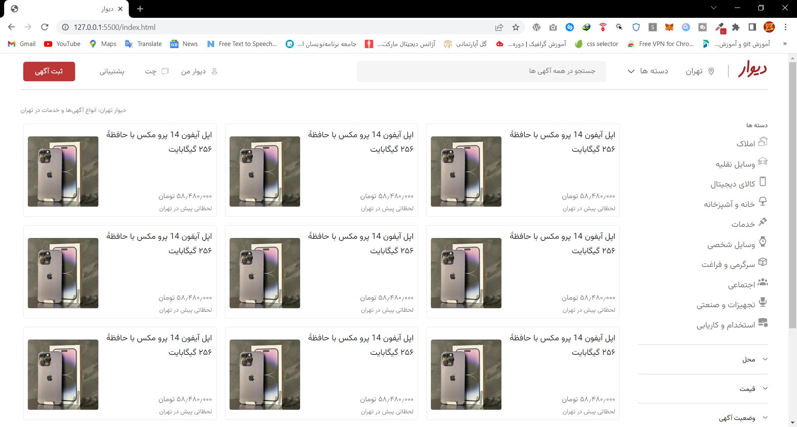
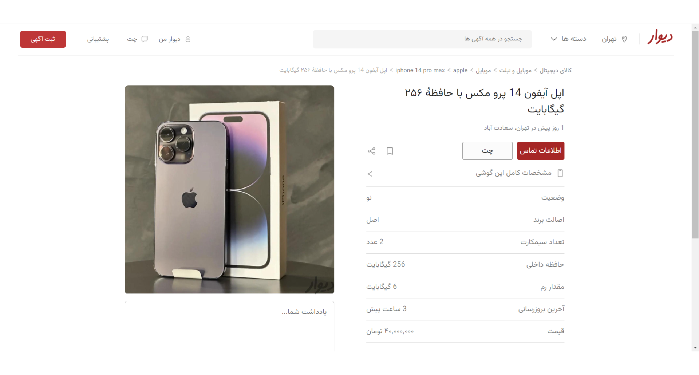

# Divar.ir Website Design - HTML and CSS

This project showcases the design of the Divar.ir website using only HTML and CSS. Divar.ir is a popular website and mobile application in Iran that serves as a platform for buying and selling new and second-hand goods, as well as providing services.

## Project Overview

The project includes homepage and product design for Divar.ir, with a focus on the product section showcasing a Iphone 14 pro max for sale. The design is created using only HTML and CSS, without any JavaScript or other frameworks. The website design is responsive.

## Technologies Used

The project uses only HTML and CSS for creating the website design. The layout is created using CSS Grid and Flexbox, while the styling is done using CSS properties such as color, font, background, and borders.

## Getting Started

To view the website design, simply open the index.html file in your web browser.

## Screenshots

## Acknowledgements

This project was inspired by the Divar.ir website, and the product used as an example is a Iphone 14 pro max for sale on the website. The project was created for educational purposes only and is not affiliated with or endorsed by Divar.ir.

## Author

This project was created by Amir Hossein Yousefi. If you have any questions or comments, you can reach me at [a.yousefi4784@gmail.com].

# طراحی سایت Divar.ir - HTML و CSS

این پروژه طراحی وب سایت Divar.ir را تنها با استفاده از HTML و CSS به نمایش می گذارد. Divar.ir یک وب سایت و اپلیکیشن موبایل محبوب در ایران است که به عنوان بستری برای خرید و فروش کالاهای نو و دست دوم و همچنین ارائه خدمات عمل می کند.

## بررسی اجمالی پروژه

این پروژه شامل صفحه اصلی و طراحی محصول برای Divar.ir، با تمرکز بر بخش محصولات نمایش آیفون 14 پرو مکس برای فروش است. طراحی تنها با استفاده از HTML و CSS، بدون هیچ گونه جاوا اسکریپت یا چارچوب های دیگر ایجاد شده است. طراحی سایت ریسپانسیو می باشد.

## زبان های مورد استفاده

این پروژه تنها از HTML و CSS برای ایجاد طراحی وب سایت استفاده می کند. طرح با استفاده از CSS Grid و Flexbox ایجاد می شود، در حالی که یک ظاهر طراحی با استفاده از ویژگی های CSS مانند رنگ، فونت، پس زمینه و حاشیه انجام می شود.

## استارت پروژه

برای مشاهده طراحی سایت کافی است فایل index.html را در مرورگر وب خود باز کنید.

## اسکرین شات

## توجه

این پروژه از وب سایت Divar.ir الهام گرفته شده است و محصول مورد استفاده به عنوان نمونه آیفون 14 پرو مکس برای فروش در وب سایت می باشد. این پروژه فقط برای اهداف آموزشی ایجاد شده است و وابسته یا تایید شده توسط Divar.ir نیست.

## برنامه نویس

این پروژه توسط امیرحسین یوسفی ساخته شده است. اگر سؤال یا نظری دارید، می توانید با من در [a.yousefi4784@gmail.com] تماس بگیرید.
